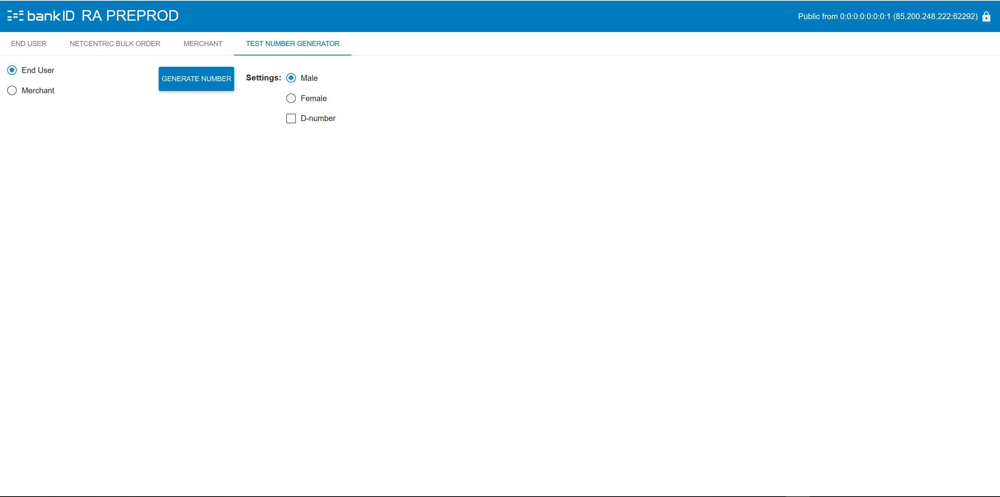
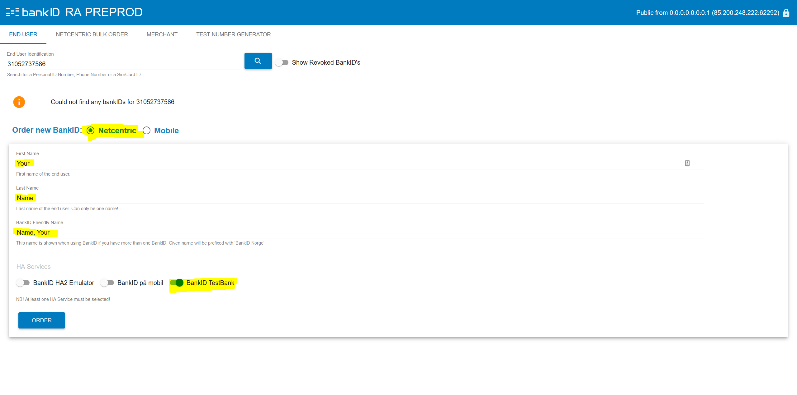
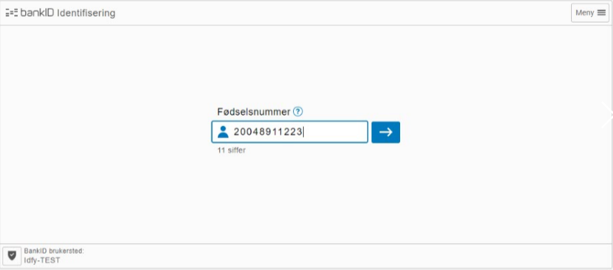
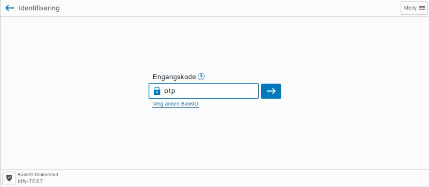
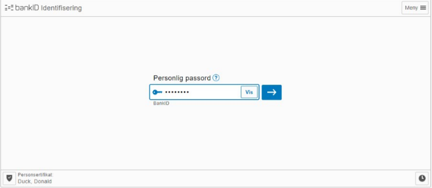
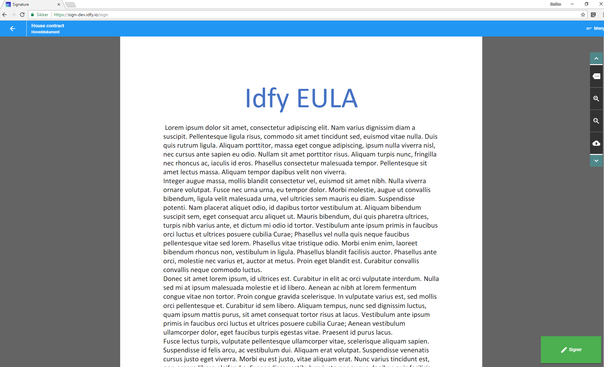
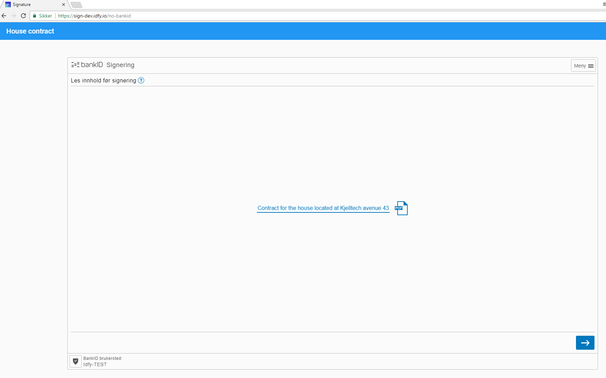
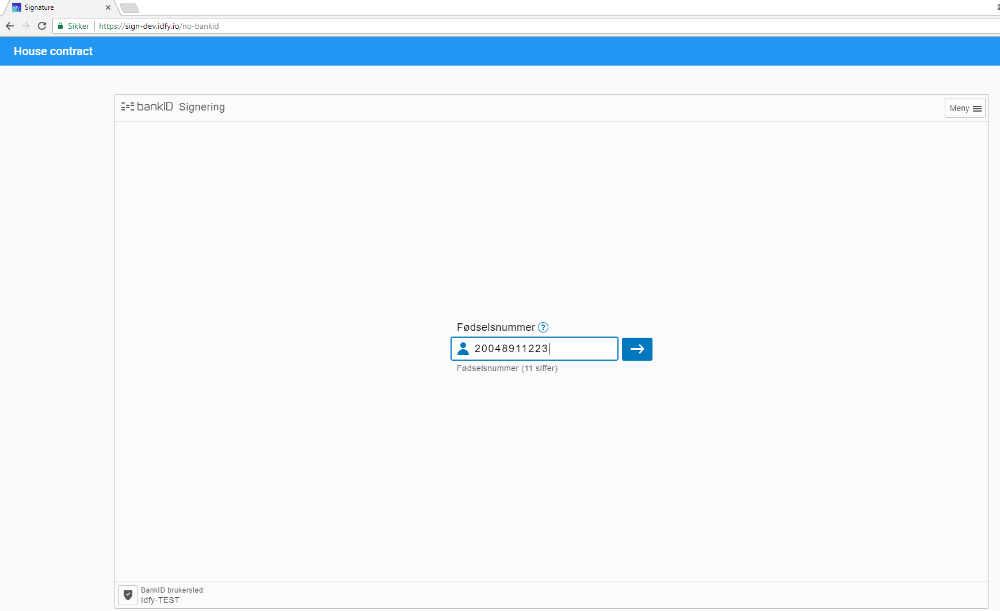
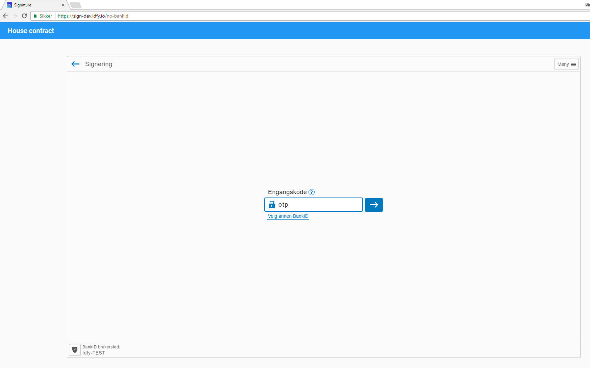
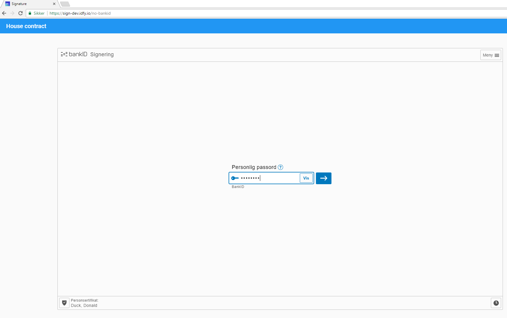

# Norwegian BankID

The first Norwegian customers were issued a BankID in 2004. At that time, the Norwegian banking sector had been working for four years on developing a joint infrastructure. Today, 3.7 million Norwegians have a BankID, and more than 1.000,000 have BankID on mobile. BankID is used by all the country’s banks and public digital services and an increasing number of enterprises in a range of different sectors. It is an express goal for BankID Norway to stimulate increased use of BankID by enterprises outside the financial sector.

Electronic identification using BankID meets the official requirements that apply to identity verification and binding electronic signature. BankID is used by all the banks in Norway and can be used by all organisations and enterprises that are looking for secure and simple identification online.

### BankID

BankID is also known as bank-stored BankID. It is the most frequently used form of digital ID in Norway, with more than 3.7 million users. With bank-stored BankID, you use your personal ID number and a code from your security token plus your personal password to log in. BankID is issued by the banks. In order to be issued a BankID, you need to appear in person at the bank and show your passport.

### BankID on mobile

Users of BankID on mobile have their BankID stored on their mobile phone’s SIM card. BankID on mobile is a user-friendly, secure and highly accessible form of ID that is growing rapidly, with more than 1,200,000 users at present. In order to sign something or verify your identity using BankID on mobile, you use your mobile phone number, date of birth and a self-selected PIN code. You need an ordinary BankID to get BankID on mobile. Setting up BankID on mobile is easy in your online banking solution, and it is ready for use in no time.

Website: [https://www.bankid.no/en](https://www.bankid.no/en)

## Technical

BankID have two clients: a JavaScript based client that is rendered in the browser \(Netcentric\), and the BankID mobile client which is a SIM Toolkit solution. Idfy supports both solutions. BankID mobile currently only support signing of plain text.

#### Generate test users
1)	Visit https://ra-preprod.bankidnorge.no/#/generate
2)	Click generate number End User selected

 
 
3)	Order new bankid with the following settings

 
 
4)	The bankid user is ready. 
  •	One time password: otp
  •	Personal password: qwer1234

#### Test users Bankid mobile

For BankID mobile you will need a test simcard from BankID. This costs 500 NOK and can be ordered by contacting us on support at [support@idfy.io](mailto:support@idfy.io).

#### Signature format

SEID-SDO is the native format for Norwegian BankID. It also support packaging to PAdES \(PDF Advances Electronic Signature\).

## Capabilities

Norwegian BankID supports both identification and signature.

## Legal

Legal information

## Certificate

**Pratical info**

How to order, prices...

**Technical info**

Types of certificates

## Screenshots from signing and identification process

### Identification

### Signing

